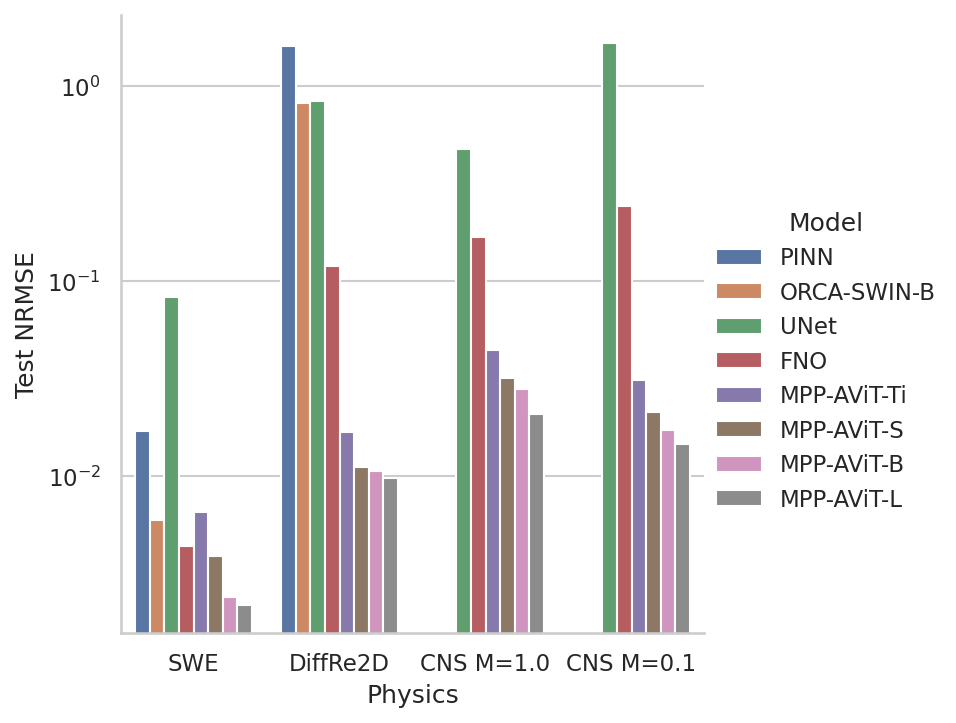
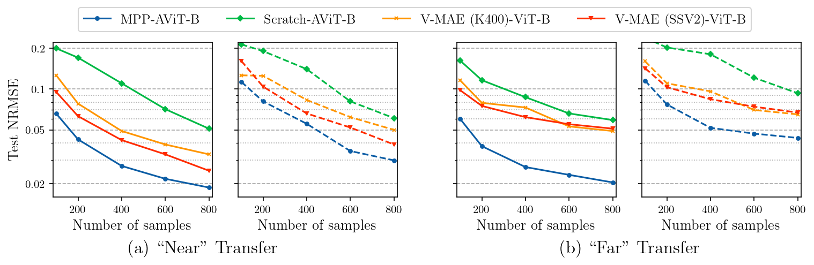

# MPP
Repository for experiment code for our paper [Multiple Physics Pretraining (MPP)](https://arxiv.org/abs/2310.02994). 

Multiple Physics Pretraining (MPP) is a pretraining strategy in which multiple sets of dynamics are jointly normalized and embedded into a single
space for prediction. 

<p align="center">
  
</p>

This forces models to learn multiple physics simulataneously and we see that despite the added difficulty of multi-task learning, our approach
is able to generate competitive results with modern architectures trained on only one task.

<p align="center">
  
</p>

Understanding multiple physics expands the range of problems that our base models are well-suited for finetuning on and in our experiments generated significant 
finetuning gains even across relatively large gaps in physics like transfer between incompressible and compressible flow:

<p align="center">
  
</p>

Here is an example rollout for a compressible Navier-Stokes simulation from a model finetuned on only 800 examples:

[](http://www.youtube.com/watch?v=NsBWGEXZC4U "Compressible Navier-Stokes Rollout")

## Installation

Our experiments were performed in an environment using slurm with modules using
venv for package management. We've made sure non-DDP training on a single device is also viable, but using DDP
in a non-slurm environment has not been verified and may require some hacking. 

Using modules, before installing the venv, you're going to need to load the required modules so you
don't run into path conflict issues. You can do this with the following script (venv location configurable):

```bash
source load_env.sh
python -m venv /path/to/new/virtual/environment
source /path/to/new/virtual/environment/bin/activate
# Note - requirements.txt might be pointing to nightly pytorch. If this causes issues, remove the versions from the torch lines in requirements.txt
# and install manually with CUDA 12
pip install -r requirements.txt 
```

submit_batch.sh will need to be updated to use the new environment:

```bash
# Replace: source $VENVDIR/pdebench_venv/bin/activate with:
source /path/to/new/virtual/environment/bin/activate
```

### Pretrained Weights

Pretrained weights are available  [here.](https://drive.google.com/drive/folders/1Qaqa-RnzUDOO8-Gi4zlf4BE53SfWqDwx?usp=sharing) 

When using pretrained models, choose the configuration (Ti/S/B/L) that corresponds to the respective file. 

## Running

Note: most experiments were performed in a multi-device context, so if you run into bugs on single device, please open an issue and let us know. 

### Slurm Launch
Most parameters are tied to the configuration file and described in comments.
An example can be found in config/mpp_avit_b_config.yaml. The namespace "basic_config" is 
configured for pretraining. "finetune" is set up for finetuning on specific data.

For slurm clusters, submit_batch.sh is used to launch jobs. This will need to be configured for your system.

Once those are configured, you should be able to launch training jobs via:
```bash
sbatch submit_batch.sh
```

### Single Device:

For single devices, use the following command:

```bash
python train_basic.py --run_name $run_name --config $config --yaml_config $yaml_config
```


## Directory Structure

```
📂 config
  |_📄 mpp_avit_b_config.yaml # Example config file for training jobs with AViT-B
  |_📄 mpp_avit_*_config.yaml # Example config file for training jobs with AViT-*
📂 data_utils # Code relating to datasets/loaders/samplers
  |_📄 datasets.py # General mixed-data sets. Contains the dictionary describing all available data.
  |_📄 hdf5_datasets.py # Individual classes relating to specific datasets. 
  |_📄 mixed_dset_sampler.py # Sampler class for uniformly sampling from different sub-dsets per micro-batch
📂 models # Code relating to PyTorch Modules
  |_📄 avit.py # Contains fully constructed AViT with MPP norm/projections
  |_📄 mixed_modules.py # Modules that operate on both space and time
  |_📄 shared_modules.py # Helper modules that can be used anywhere
  |_📄 spatial_modules.py # Modules that operate on space
  |_📄 time_modules.py # Modules that operate on time
📂 utils # Misc helpers
  |_📄 YParams.yaml # Helper class for yaml configs
📄 load_env.sh # Modules setup for installation
📄 requirements.txt # Pip requirements file
📄 submit_batch.sh # Example slurm submission - modify depending on needs
📄 train_basic.py # Trainer file parameterized by configs.
```

## Adding additional datasets

All datasets are currently assumed to be 2D and return in (Batch, Time, Channel, H, W) order. You can 
add an additional dataset by modifying data_utils/datasets.py to create a dataset
that returns data in this format. Any dataset
must follow the BaseHDF5DirectoryDataset API to work out-of-the-box, though this can be extended with more effort.

The following instructions assuming you have implemented a dataloader as an extension of BaseHDF5DirectoryDataset.
This is not required, but it will make this much easier as otherwise you will need to parse more complicated
logic to mimic the API for compatibility with the rest of the code. 

### For Pretraining

1. Define NewDataset(data_utils.hdf_datasets.BaseHDF5DirectoryDataset) - This requires implementing _specifics, _get_specific_stats, _get_specific_bcs, and _reconstruct_sample
methods. Examples can be found in data_utils.hdf5_datasets.py
2. In data_utils/datasets.py, add your dataset to the DSET_NAME_TO_OBJECT dictionary. 
3. In the config file (eg, config/mpp_avit_b_config.yaml), add your new data to train or valid data paths (or both). This is structured [path, dset_type (defined in DSET_NAME_TO_OBJECT), filter_string], Note that these operate on a directory basis and will load all files in the directory containing the filter_string using the object corresponding to the dset type.
4. In the config file, ensure that n_states is sufficiently large to handle all state variables included. If this is oversized, it just adds additional memory usage proportional to embed_dim*n_states. 
5. Train normally

### For finetuning

Model weights are available [here.](https://drive.google.com/drive/folders/1Qaqa-RnzUDOO8-Gi4zlf4BE53SfWqDwx?usp=sharing)

If the finetuning is done using models trained AFTER the dataset is added, the instructions above are sufficient. If finetuning is performed
using our provided weights, then this becomes slightly more complicated since the dimensions of the input/output projection matrix 
with be whatever the n_states was for training (it is 12 for all provided weights).

We plan on making this easier, but the process right now is as follows:

1. Define NewDataset(data_utils.hdf_datasets.BaseHDF5DirectoryDataset) - This requires implementing _specifics, _get_specific_stats, _get_specific_bcs, and _reconstruct_sample
methods. Examples can be found in data_utils.hdf5_datasets.py
2. In data_utils/datasets.py, add your dataset to the DSET_NAME_TO_OBJECT dictionary. __MAKE SURE YOU ADD THE NEW DATASETS TO THE BOTTOM__.
4. Set n_states equal to the training n_states for the pretrained models (12 for our weights).
5. Add any dataset names you have defined to "append_datasets" in the config file.
6. Run train_basic.py using the config namespace "finetune". 


